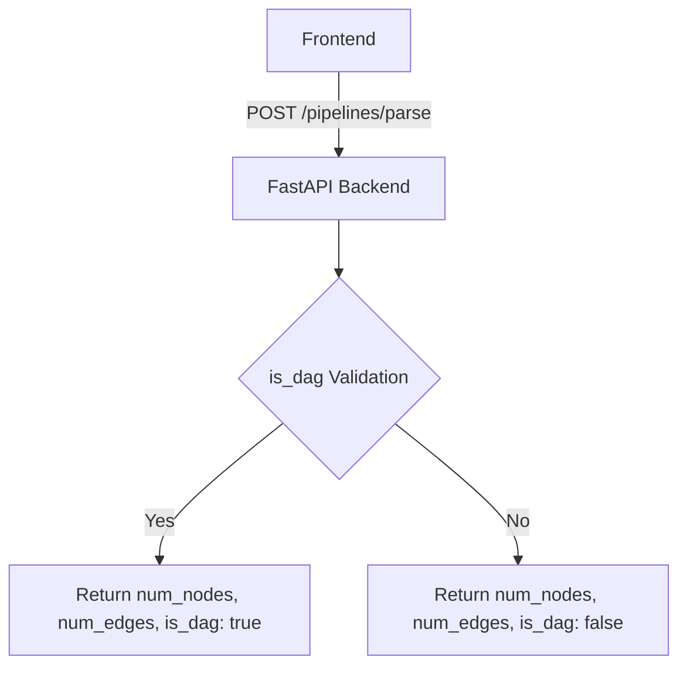

# vectorshift-ai-flowgraph-backend
A visual node-based workflow builder that enables users to design AI pipelines through an interactive graph interface. The project demonstrates scalable node abstraction, dynamic variable parsing in text nodes, responsive UI design, and backend pipeline validation including node/edge counting and Directed Acyclic Graph (DAG) detection.

## Backend Overview

The backend is built with **FastAPI** and provides endpoint(s) for pipeline validation.

### Key Features
- **Pipeline Parsing**: Accepts node and edge data to calculate graph statistics.
- **DAG Detection**: Implements a cycle detection algorithm to ensure the pipeline is a Directed Acyclic Graph (DAG).
- **CORS Support**: Configured to allow requests from the frontend application.

### Pipeline Validation Flow

## Running the Backend

1. Install dependencies: `pip install fastapi uvicorn`
2. Start the server: `uvicorn main:app --reload`
